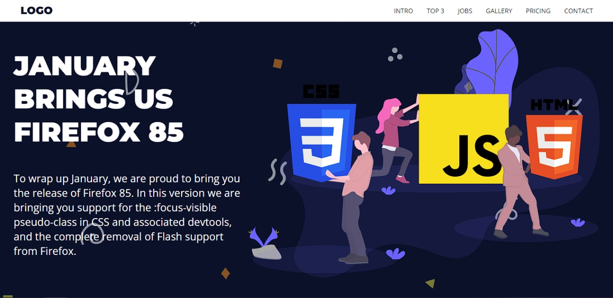
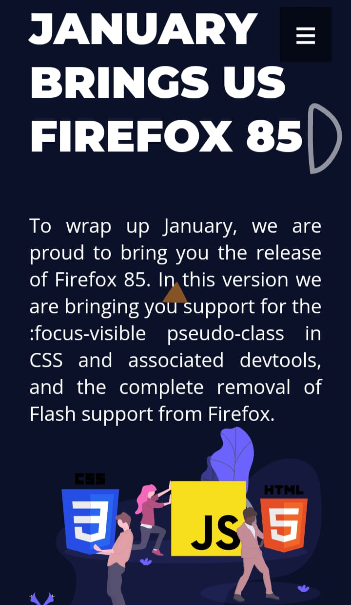

# <a href='https://fhugomendes.github.io/Landing-page/' target='_blank'>Landing-page</a>

 Um site responsivo de uma Landing Page criada utilizando os conhecimentos de HTML e CSS
 
 <h2>Versão de Desktop:</h2>
 
 
 
 
<h2>Versão do Mobile:</h2>

